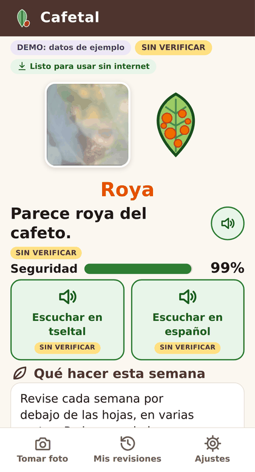
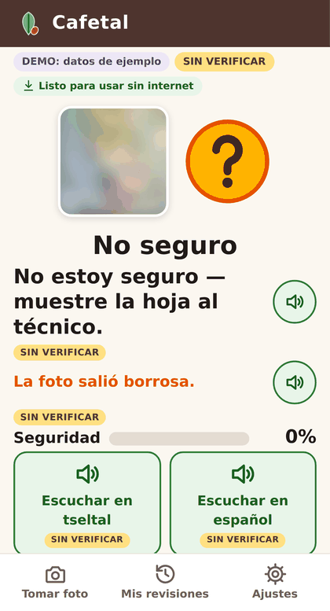
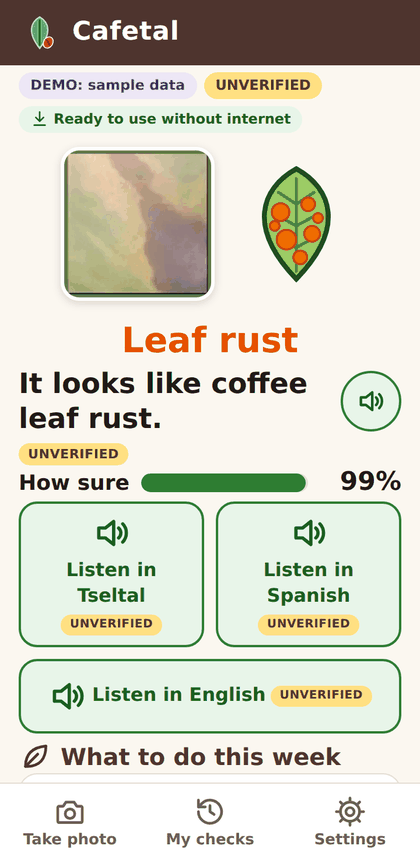
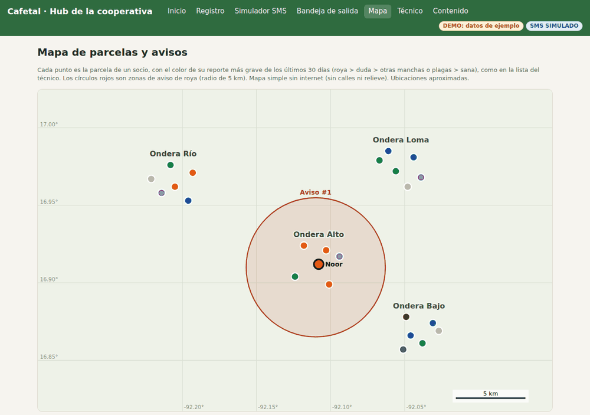
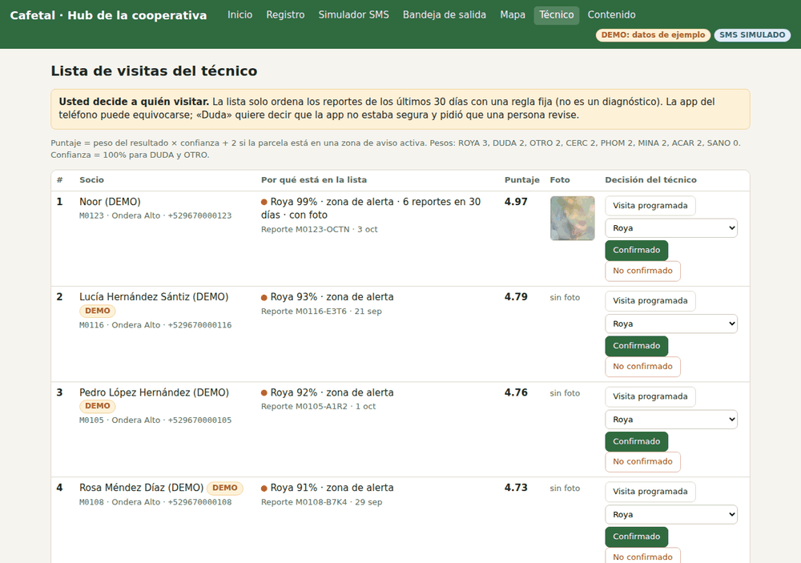
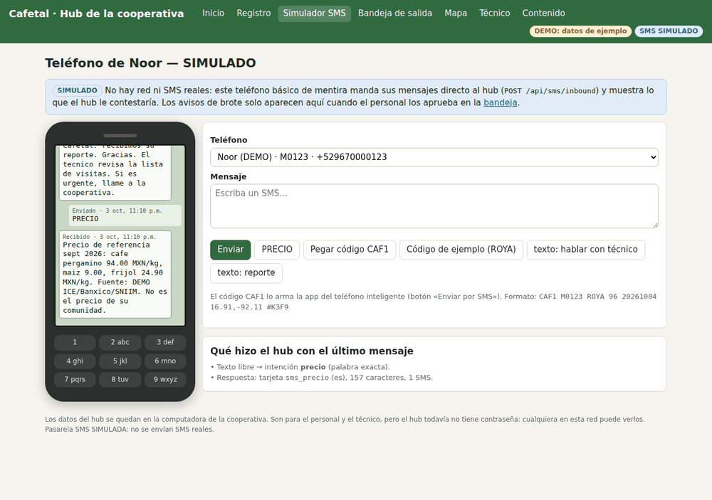

# Cafetal: an offline coffee crop doctor for Noor's cooperative

Cafetal is a small AI tool for a smallholder coffee farmer, Noor, and her cooperative in the Chiapas highlands of
Mexico. Local language: **Tseltal** (`tzh`). National language: **Spanish** (`es`). Noor photographs a coffee
leaf with her daughter's Android phone. A small image model on the phone checks it offline, and the phone plays short,
fixed advice in Tseltal and Spanish. (English is a third interface language, added for judges and visitors.) If it
is not sure, it says *"No estoy seguro — muestre la hoja al técnico"* ("I'm not sure, show the leaf
to the extension officer"). The result goes to the co-op as one SMS. At the co-op, a hub keeps a member registry
with consent, an outbreak map, alerts that staff approve before they go out, and a visit list for the extension
officer. From her basic phone, Noor can also text `PRECIO` to get a reference price. That part is not AI.

Built for the World Bank × Hack-Nation "Small AI for Development" hackathon, Agriculture track (Annex B of
[docs/concept-note.pdf](docs/concept-note.pdf)).

**The one decision we improve:** *"Is something attacking my coffee, and what do I do this week: handle it myself,
or get the extension officer to come?"*

**Problem statement** (template from the concept note §08; the same sentence is in [VIDEO_SCRIPT.md](VIDEO_SCRIPT.md)
and [docs/evidence.md](docs/evidence.md)):

> Because of Cafetal, **Noor** will **get a sick-looking coffee leaf onto her extension officer's visit list, with
> spoken advice in Tseltal while she waits,** by **the same weekend she notices it**, which she would otherwise **do
> late: whenever the officer next comes by, twice a year at best**; we know because **that is the gap the challenge
> brief describes for her (concept note, Annex B, 2026).**

It promises only what the shipped build does: a "not sure" answer still puts the farm on the officer's list. It
does **not** promise that Noor will know which disease she has. On held-out field photos the shipped model names
rust correctly in about two of three rust photos (64%) but rarely names the other diseases, and it gives a disease
answer to 2.5% of ordinary coffee-plant photos, so the officer confirms
([reports/field_eval.md](reports/field_eval.md)).

The "we know because" part has two kinds of evidence:

- **Read from the source:** the concept note says the extension officer reaches Noor's area twice a year at best
  (code L in [docs/evidence.md](docs/evidence.md)).
- **Not yet checked:** the figures on rust losses in Mexico and on how few farms get technical assistance. We
  only saw them in search-result summaries (code S). Open each source before quoting any of them on stage.

---

## How it works: three parts, on devices people already have

```
 Daughter's Android phone (weekends, OFFLINE)             Noor's basic phone (SMS only)
 +-------------------------------------------+            +-----------------------------+
 | Web app (PWA), cached by a service worker |            | texts PRECIO, free text,    |
 | photo -> blur check -> image model (on    |            | receives replies and alerts |
 |   the phone) -> fixed advice card + audio |            +--------------+--------------+
 |   in Tseltal / Spanish (English: visitors)|                           |
 | saved on the phone under a member ID      |                           | SMS
 +----------------------+--------------------+                           |
                        | 1 SMS "CAF1 M0123 ROYA 96 ..." (user taps Send) |
                        | photos only over co-op Wi-Fi, only on tap       |
                        v                                                 v
 +--------------------------------------------------------------------------------------+
 | Co-op hub: the co-op's computer, FastAPI + SQLite, no internet needed                |
 | member registry + consent | SMS inbox (gateway SIMULATED) | outbreak rule + SVG map  |
 | outbox: alerts wait for staff "Aprobar" | officer visit list (the officer decides)   |
 | PRECIO reply (not AI) | free-text SMS sorter | card review + native-voice recording  |
 +--------------------------------------------------------------------------------------+
```

1. **Phone app** ([app/](app/)): plain HTML/JS, no build step. After one online load it works in airplane mode:
   app, model, the 83 cards and their audio (222 MP3s, about 3.5 MB) are cached. Diagnosis runs on the phone with onnxruntime-web (WASM).
   Records are stored in the phone's browser (IndexedDB) under a member ID, with an optional PIN and a
   "delete everything" button.
2. **SMS** ([app/sms.js](app/sms.js), [hub/sms.py](hub/sms.py)): the app builds a one-SMS code (at most 160
   characters, format in [PLAN.md](PLAN.md) §5) and opens the phone's own SMS app. The user still taps Send. In
   this build the gateway is **SIMULATED**: a simulator page plays Noor's basic phone, and an "Enviar (SIMULADO)" button sends
   the code straight to the hub.
3. **Co-op hub** ([hub/](hub/)): one Python process that also serves the phone app. Spanish pages for co-op
   staff and the extension officer: registry, SMS simulator, outbox, map, officer worklist, content review.

## Why AI, and what is not AI

AI is used in two small places:

| What | Model | Why a simpler tool would not do |
|---|---|---|
| Leaf photo → `sano` / `roya` / `minador` / `phoma` / `cercospora` / `otro` (not a coffee leaf) | MobileNetV3-Small, fine-tuned, ONNX, 1.97 MB, runs on the phone | Telling rust from leaf miner or leaf spots in a photo is pattern recognition. An SMS menu, a spreadsheet or a web search cannot look at a leaf, and there is usually no data connection. |
| Free-text SMS → `precio` / `reporte` / `ayuda` / `hablar_con_tecnico` / `otro` | Character n-gram TF-IDF + logistic regression, pure-Python inference in the hub | Members can write the way they talk ("cuanto estan pagando el kilo de cafe") instead of learning codes. |

**Not AI, and we say so:**

- the blur check (a fixed formula)
- the confidence threshold and the fail-safe
- the advice cards (fixed text: Spanish written by the team; Tseltal drafted with an AI model and marked SIN
  VERIFICAR; English translated from the Spanish by an AI model for visitors, also SIN VERIFICAR) and their audio
  (synthetic, rendered once with Piper TTS, not generated on the phone or the hub)
- the SMS code
- the outbreak rule: 3 or more members report rust within 5 km in 7 days. These are design choices, not
  agronomic thresholds.
- the worklist ranking, the PRECIO price lookup and the registry

No generative model runs in the app or the hub. Generative AI was used only offline, while building: an AI model
drafted the Tseltal card text and the English translation (both unverified), and Piper TTS rendered the audio once. Every sentence a farmer sees or
hears comes from [content/cards.json](content/cards.json).

**Guardrails:**

- **Fail-safe:** the app says "No estoy seguro…" for a blurry photo, a "not coffee" answer or confidence below 90%,
  and the report puts the farm on the officer's list.
- **Nothing sent by itself:** no SMS leaves the phone without the user's tap. Outbreak alerts wait for a co-op
  staff member to press "Aprobar".
- **The officer decides** who to visit.
- **UNVERIFIED badges:** every text and audio that no person has checked shows **SIN VERIFICAR** in the app and on
  the hub pages. SMS sent to basic phones cannot carry a badge, so the 9 SMS and alert cards are unverified text that
  members receive as-is (the outbox shows SIN VERIFICAR).

Details: [RESPONSIBLE_AI.md](RESPONSIBLE_AI.md).

## Screenshots

From the automated tests ([tests/e2e/journey.mjs](tests/e2e/journey.mjs) and
[tests/e2e/app_offline.mjs](tests/e2e/app_offline.mjs)). The phone views are desktop Chromium with a Pixel 5 profile,
not a real phone. The rust result is a Kenyan lab close-up from the test split, not a field photo.

<p>






</p>

From left to right:

1. rust result with Tseltal and Spanish audio
2. fail-safe for a blurry photo
3. the English interface (for judges and visitors), with an extra "Listen in English" button
4. outbreak zone on the co-op map
5. the officer's visit list (Noor ranked first)
6. Noor's simulated basic phone getting the PRECIO reply

All screenshots are in [reports/screenshots/](reports/screenshots/).

## Quick start (8 steps)

You need Python 3.10 or newer (we used 3.11), internet for the first install only, and Chrome. For the phone you
also need an Android phone with Chrome and `adb` (Android platform-tools).

1. Clone this repository and `cd` into it.
2. Run **`./run.sh`**. The first time, it creates `.venv` and installs three packages from PyPI. Then it loads
   the DEMO data into `hub/cafetal.db` (only if that file is missing) and starts the hub on port 8000. Use
   `PORT=9000 ./run.sh` if port 8000 is taken.
3. Open **http://localhost:8000/**: the co-op hub, in Spanish.
4. Open **http://localhost:8000/app/**: the phone app. It also works in desktop Chrome, best with DevTools in
   device mode.
5. Phone: turn on USB debugging, connect the cable, and run **`adb reverse tcp:8000 tcp:8000`**.
6. On the phone, open **http://localhost:8000/app/** in Chrome. Wait for the green **"Listo para usar sin
   internet"** label. The first load is 16.81 MB of files, 8.59 MB over the wire with the hub's gzip (see
   [reports/browser_metrics.md](reports/browser_metrics.md)).
7. Go offline (airplane mode, **and unplug the USB cable**, because `adb reverse` still works over USB). Then take
   or choose a photo. The full click-by-click demo is in **[DEMO.md](DEMO.md)**.
8. Stop the hub with Ctrl+C. To get fresh DEMO dates next time, run `rm hub/cafetal.db*`, or press "Reiniciar
   datos DEMO" on the hub home page.

**Verified:** on 2026-10-03 we followed steps 1–4 from a fresh clone (Python 3.11):

- `./run.sh` created the venv, installed the packages, loaded the DEMO data and served every page and API we
  requested.
- The full journey test and the app offline test then passed against that clone.
- Steps 5–7 need a real phone and were **not** run here.
- Re-checked later the same day, after image model v2 was installed (in the working copy, not a fresh clone):
  `PORT=8050 ./run.sh` loaded the DEMO data and answered 200 on `/`, `/app/` and `/api/health`.

### Why localhost or HTTPS: the secure-origin rule

Browsers allow service workers (offline mode), the Cache API and geolocation only on `https://` or
`http://localhost`.

- `http://localhost:8000` on the hub computer is fine.
- On `http://<hub-ip>:8000/app/` from another device, the app still diagnoses while the hub is reachable. But
  it **will not work offline**, and the SMS location is `-`.

Ways to get a secure origin on the phone:

1. **USB + `adb reverse`** (recommended, steps 5–6 above). The phone sees the hub as `localhost`.
2. **Static HTTPS host.** Run `.venv/bin/python scripts/bump_sw_version.py`. Then put `app/` and `content/` side
   by side on any HTTPS static host. The hub buttons stay hidden there, because there is no hub to reach.
3. **Demo only:** on the phone, open `chrome://flags/#unsafely-treat-insecure-origin-as-secure` and add
   `http://<hub-ip>:8000`. This weakens the browser's security, so never do it on a farmer's phone.

## Run the tests

| What | Command | Notes |
|---|---|---|
| Hub unit tests | `.venv/bin/pip install pytest httpx` then `.venv/bin/python -m pytest tests -q` (or `make test`) | Uses a temporary database. Last run (2026-10-03): 65 passed, 1 skipped. The skipped test needs scikit-learn: it checks the pure-Python intent model against scikit-learn. |
| Phone app, offline | `node tests/e2e/app_offline.mjs` | Starts its own server. Checks onboarding, diagnosis, the fail-safe, PIN, delete, simulated send and sync (also with a member ID the hub does not know). Screenshots: `reports/screenshots/app_*.png`. |
| Whole journey | start `./run.sh`, then `node tests/e2e/journey.mjs` | Covers every item of the Definition of Done in [docs/CLAUDE_CODE_PROMPT.md](docs/CLAUDE_CODE_PROMPT.md). **Resets the DEMO data** before and after (`KEEP_STATE=1` keeps the end state). Writes `reports/journey_results.json` and `reports/screenshots/journey_*.png`. `HUB=http://localhost:9000` for another port. |
| Browser metrics | with the hub running: `node tests/e2e/browser_metrics.mjs` | Emulated latency and 3G download → `reports/browser_metrics.md`. |

The e2e tests need Node.js (we used 22) and the `playwright` npm package, local or global. They need a Chromium:
set `CHROMIUM=<path>` if Playwright cannot find its own. On your own machine, `npx playwright install chromium`
provides one.

Model training and evaluation are separate. See [model/README.md](model/README.md); they need
`requirements-train.txt`, not the hub's venv.

## Repository layout

```
run.sh                  one command: venv + deps + DEMO data + hub on 0.0.0.0:8000
requirements.txt        hub runtime only (fastapi, uvicorn, python-multipart)
requirements-train.txt  image-model and intent training (tensorflow-cpu, tf2onnx, onnxruntime, scikit-learn, ...)
Makefile                make demo | make test | make intent
app/                    phone PWA (vanilla JS, no build). model/ = cafetal.onnx + labels.json; vendor/ = onnxruntime-web
hub/                    co-op hub (FastAPI + SQLite); static/ = hub pages; seed.py = DEMO data
content/                cards.json (every farmer-facing sentence) + audio/es, audio/tzh, audio/en (MP3)
model/                  data prep, training, ONNX export, evaluation, iNaturalist field evaluation; demo_samples/
data/                   prices.json (DEMO), intent/ (SMS examples), field_test/ (empty: the team's own photos go here)
scripts/                make_audio.py (Piper -> MP3), bump_sw_version.py (offline-cache version)
tests/                  pytest for the hub; e2e/ = Playwright tests (app offline, whole journey, browser metrics)
reports/                evaluation results (md + json), screenshots
docs/                   concept-note.pdf, evidence.md (figures + verification codes), CLAUDE_CODE_PROMPT.md
```

## Key numbers

All numbers are **measured**, except where the table says *emulated* or *computed*. Details and caveats are in
[METRICS.md](METRICS.md). The sources are the report files linked in each row.

The model in the app is **v2** (`cafetal-img-v2`) at confidence threshold **0.90**. The "v1" figures are the
previous model (threshold 0.70), on the same images, for comparison.

| What | Value | Source |
|---|---|---|
| Image model size | **1.97 MB** (1,972,422 bytes), fp16 weights; the limit is 10 MB. INT8 was tried: static INT8 broke the model (15.1% validation accuracy); INT8 weights scored 0.971 validation macro-F1 vs 0.978 for fp16. | [model_eval.md](reports/model_eval.md) (d), calibration |
| Held-out test split (Kenya, JMuBEN, split by near-duplicate group; n = 2,946) | accuracy **98.6%**, macro-F1 **0.985** (v1: 98.5%, 0.985). As the app decides (threshold + blur check): **93.8%** of coffee photos answered (v1 95.9%), **100.0%** of answers correct (v1 99.9%), **0** diseased leaves called "sano" (v1 0). App-level macro-F1 0.967 (v1 0.977): see the ship rule below. | [model_eval.md](reports/model_eval.md) (a) |
| Non-coffee test images sent to "No estoy seguro" | **98.2%** (438 of 446; v1 99.8%). The 8 accepted are 7 distinct photos, mostly apple rust or scab leaves answered "roya". | [model_eval.md](reports/model_eval.md) (a) |
| **Field proxy:** held-out iNaturalist rust photos, from observers never used in training | **64.2% correct** [95% CI 51–76] (34 of 53; v1 0 of 53); the other 19 got "No estoy seguro". Leaf symptom visible: 81.0%. Mexico + Guatemala box: 74.2%. Inside Mexico: 2 of 4. Leaf miner 2 of 9, Cercospora 0 of 10. No diseased photo was called "sano". | [field_eval.md](reports/field_eval.md) |
| **False alarms on field photos:** *Coffea* plant photos (health unknown) that get a disease answer | **2.5%** [1.4–4.5] (10 of 399; v1 0%) | [field_eval.md](reports/field_eval.md) |
| Our own Chiapas photos | **0 collected** so far | [data/field_test/](data/field_test/README.md) |
| Diagnosis time, *emulated* phone: desktop Chromium with a Pixel 5 profile, CPU slowed 4x | **51.7 ms** median per photo once loaded (53 ms for a 12 MP photo, not counting JPEG decoding); first photo **2.5 s** (runtime + model load) | [browser_metrics.md](reports/browser_metrics.md) |
| Download over *emulated* 3G (750 kbps down, 100 ms latency) | model alone **21.2 s**; whole offline bundle **94 s** (1.6 min; 251 files, 8.59 MB on the wire with gzip, 16.81 MB unpacked). Slow 3G: 39.9 s and 177.5 s. | [browser_metrics.md](reports/browser_metrics.md) |
| Free-text SMS sorter, held-out 20% (n = 115) | accuracy **0.913**, macro-F1 **0.866** with the threshold. Without the off-topic MASSIVE examples (n = 57): 0.842 / 0.820. Tseltal: too few examples to measure. | [intent_eval.md](reports/intent_eval.md) |
| Cards checked by a person | **0 of 83**, in all three languages | [content/cards.json](content/cards.json) |

**v2 was shipped as an exception to our own ship rule.** Before scoring v2's field results we fixed five
conditions a new model had to meet against v1. v2 added 147 screened iNaturalist field photos (rust, leaf miner,
Cercospora; none from Mexico) to training. Its threshold (0.90) was chosen on separate calibration photos only, and
fixed before the test sets were scored at that threshold.

- **It meets 4 of the 5 conditions:** field rust +64 points, non-coffee rejection at least 98%, no more diseased
  leaves called "sano", and a *Coffea* false-alarm rise of at most 5 points.
- **It misses condition (2) by 0.04 points.** The JMuBEN app-level macro-F1 may drop at most 1 point; it drops 1.04
  (0.9670 vs 0.9774). The plain (argmax) macro-F1 does not drop (0.9850 vs 0.9845). The cause: more Kenyan close-ups
  now get "No estoy seguro", mostly phoma (correct 98.4% → 86.8%).
- **The team decided to ship it anyway** (2026-10-03, recorded in
  [model/ship_decision.json](model/ship_decision.json)). The close-ups it no longer answers get the fail-safe, not
  a wrong answer. And v2 is the only model we have that finds rust in field photos.
- The rule's own verdict ("DO NOT SHIP") is kept as computed in
  [field_v2_threshold_test.json](reports/field_v2_threshold_test.json). Full numbers:
  [field_eval.md](reports/field_eval.md) ("Result", "Threshold trade-off").

## Honest limitations

- **Field accuracy is partial, and measured only on a proxy.** On held-out iNaturalist field photos the shipped
  model names rust in 34 of 53 rust photos (64%); the rest get "No estoy seguro". It names leaf miner in 2 of 9
  and Cercospora in 0 of 10. Only 4 of the rust test photos are from Mexico, and none from Noor's area.
  - A live photo of a real leaf may now get an answer instead of "No estoy seguro". A clear rust close-up often
    does; a whole tree or a distant shot usually does not.
  - **False alarms exist.** A disease answer was given to 2.5% of ordinary *Coffea* plant photos and to 8 of 446
    non-coffee test images (mostly apple rust or scab leaves called "roya"). So the officer confirms on his visit,
    and the farm goes on his list either way.
  - The published experience is similar: a model scoring 99.35% on its own test set scored 31.4% on photos taken
    in other conditions (Mohanty et al. 2016; code F in [docs/evidence.md](docs/evidence.md)).
  - The fix is officer-confirmed photos from Chiapas, healthy and diseased. The hub already stores the officer's
    confirmations as labelled examples.
- **Shipped against one of our own ship-rule conditions** (app-level F1 −1.04 points, limit −1.00; see Key
  numbers). The cost is more "No estoy seguro" on Kenyan close-ups, mostly phoma, not more wrong answers.
- **No Mexican training images.** The healthy class was learned from only 7 groups of near-identical Kenyan
  photos. Red spider mite (`acaro_rojo`) is not in the model. The app sees only leaf symptoms: not coffee berry
  borer (broca), nutrients, drought, old trees or soil. The app says so.
- **Tseltal text is an AI draft, and Tseltal audio is a Spanish synthetic voice reading it.** No native speaker
  has checked either, and no card is verified in any language. The app shows SIN VERIFICAR.
- **English is for visitors, and also unverified.** The English text is an AI translation of the Spanish, read by
  an English synthetic voice (Piper `en-us-lessac-medium`). Tseltal and Spanish stay the main languages. The hub
  can register a member in English and answers the English SMS keywords PRICE, HELP and OFFICER.
- **Prices are DEMO.** Every figure in [data/prices.json](data/prices.json) was seen only in web-search summaries.
  They are national or international reference prices, never the farm-gate price.
- **The SMS gateway is simulated.** No real SMS is sent. The gateway number in [app/config.json](app/config.json)
  is a DEMO placeholder.
- **Timing and download figures are emulated** on a desktop browser, not measured on a phone or a real network
  (see the Team TODO).
- **The SMS sorter is small.** It was trained on team-written examples. Tseltal free text mostly goes to the
  officer.
- **The hub has no login.** Anyone on the co-op network can open it, including the DEMO reset button. Before
  real use, keep it on the co-op computer only or put a password in front of it.
- **Most problem figures are unverified** (code S in [docs/evidence.md](docs/evidence.md)).

## Data, models and licences

| Item | Licence | How we used it |
|---|---|---|
| JMuBEN / JMuBEN2 (Jepkoech et al. 2021, *Data in Brief* 36:107142), via the AgML public bucket | CC BY 4.0 | Train / validation / test for the 5 coffee classes. 10 test crops, plus one blurred copy, are in [model/demo_samples/](model/demo_samples/README.md). |
| PlantDoc (Singh et al. 2020) | CC BY 4.0 per the repository; AgML's metadata says CC BY-SA 4.0 (to be checked). The images were collected from the web, so copyright varies per image. | "Not a coffee leaf" (`otro`) training. Not redistributed. |
| Imagenette (fast.ai) | Repository Apache-2.0. The images are a subset of ImageNet, so ImageNet's terms apply (non-commercial research). | `otro` training (non-plant images). Not redistributed. |
| iNaturalist photos: 768 field photos, 400 *Coffea* calibration photos, 200 iNatAg-mini *Coffea arabica* photos | Per photo: CC0, CC BY, CC BY-SA, CC BY-NC, CC BY-NC-SA, CC BY-NC-ND. iNatAg-mini: CC BY-NC 4.0 in our evaluation code (to be checked). | Evaluation and threshold calibration; 147 field photos also trained the shipped v2. Not in the repo, except one CC BY demo photo (`model/demo_samples/field_whole_tree.jpg`). The two CC BY-NC demo rust photos are downloaded on the demo machine (`python3 model/demo_samples.py --field`). Attribution: [field_inat_attribution.csv](reports/field_inat_attribution.csv), [field_calib_attribution.csv](reports/field_calib_attribution.csv). |
| Amazon MASSIVE 1.1, es-ES | CC BY 4.0 | 300 off-topic examples for the SMS sorter. |
| MobileNetV3-Small ImageNet weights (Keras Applications) | Apache-2.0 | Starting point for the image model. |
| Piper TTS (MIT), voices `es-mls_10246-low` and `en-us-lessac-medium` | Spanish voice trained on Multilingual LibriSpeech (OpenSLR 94, CC BY 4.0, per its model card); English voice trained on the Blizzard 2013 Lessac data (licence on the CSTR page linked in its model card). Licence of the voice weights themselves: to be checked. | Rendered the Spanish, provisional Tseltal and English MP3s at build time (espeak-ng `es-419` phonemes for Spanish and Tseltal). Piper itself is not shipped. |
| onnxruntime-web 1.19.2 (Microsoft) | MIT | Runs the model in the phone's browser. Vendored in [app/vendor/](app/vendor/README.md). |
| Polian (2018), *Tseltal-Spanish multidialectal dictionary* (Dictionaria) | CC BY 4.0 | Vocabulary checks for the Tseltal drafts. |
| FastAPI, Uvicorn, python-multipart | MIT, BSD-3-Clause, Apache-2.0 | Hub runtime. |

Full data card: [DATA_CARD.md](DATA_CARD.md). Per-dataset notes: [model/README.md](model/README.md).

## Other documents

- [DEMO.md](DEMO.md): click-by-click demo for the video and for judges
- [METRICS.md](METRICS.md): model size, accuracy (test split vs field), latency, download time
- [DATA_CARD.md](DATA_CARD.md): every dataset, its licence, and what it does not cover
- [RESPONSIBLE_AI.md](RESPONSIBLE_AI.md): fail-safe, human in the loop, consent, privacy, lost phones, bias, less-supported languages
- [VIDEO_SCRIPT.md](VIDEO_SCRIPT.md): the 2–5 minute video
- [PLAN.md](PLAN.md): the build plan and shared contracts (labels, SMS code, API, rules). It was written before
  the build, so some details differ from what shipped; where they disagree, METRICS.md and DATA_CARD.md describe
  the build.
- [PROJECT_BRIEF.md](PROJECT_BRIEF.md): the pre-build product brief and the judging criteria
- [docs/evidence.md](docs/evidence.md): figures behind the problem, with verification codes
- Reports: [model_eval.md](reports/model_eval.md), [field_eval.md](reports/field_eval.md),
  [browser_metrics.md](reports/browser_metrics.md), [intent_eval.md](reports/intent_eval.md)
- Component notes: [app/README.md](app/README.md), [content/README.md](content/README.md),
  [model/README.md](model/README.md), [data/field_test/README.md](data/field_test/README.md)

## Team TODO before submission (end of Oct 4, 2026)

- [ ] **Record native Tseltal audio.** On the hub's Contenido page, use "● Grabar" or "Subir archivo",
      starting with `diag_*`, `advice_*` and `diag_duda`.
- [ ] **Have the cards verified on the Contenido page:** an agronomist or the officer for the Spanish advice,
      and a native Tseltal speaker for the Tseltal text and voice.
- [ ] **Collect our own field photos** into `data/field_test/<label>/` and rerun `model/evaluate.py`. Only label
      photos that an agronomist or the officer confirmed. Healthy leaves matter as much as diseased ones.
- [ ] **Replace the DEMO prices** in `data/prices.json` with values checked on the official pages, then set
      `demo` to false.
- [ ] **Measure on a real phone and a real 3G connection** (the Definition of Done asks for measured, not
      estimated). On the demo phone, note the first and a later diagnosis time (each saved record stores it as `ms`
      in IndexedDB; read it with Chrome remote debugging, `chrome://inspect`) and the time until "Listo para usar
      sin internet" on a mobile connection. Add them to METRICS.md, with the phone model, as measured, next to
      the emulated figures.
- [ ] **Download the two field demo photos** on the demo machine: `python3 model/demo_samples.py --field` (needs
      internet once; see [DEMO.md](DEMO.md) §1).
- [ ] **Write "our take"** in [VIDEO_SCRIPT.md](VIDEO_SCRIPT.md), in our own words.
- [ ] Open the source behind every S-coded figure that the video quotes.
- [ ] Pull the FAOSTAT yield trend for Mexico (steps in [docs/evidence.md](docs/evidence.md), "How to close the
      gaps"); the brief asks for it.
- [ ] Choose a licence for our code. Data, content and vendored files keep their own licences.
