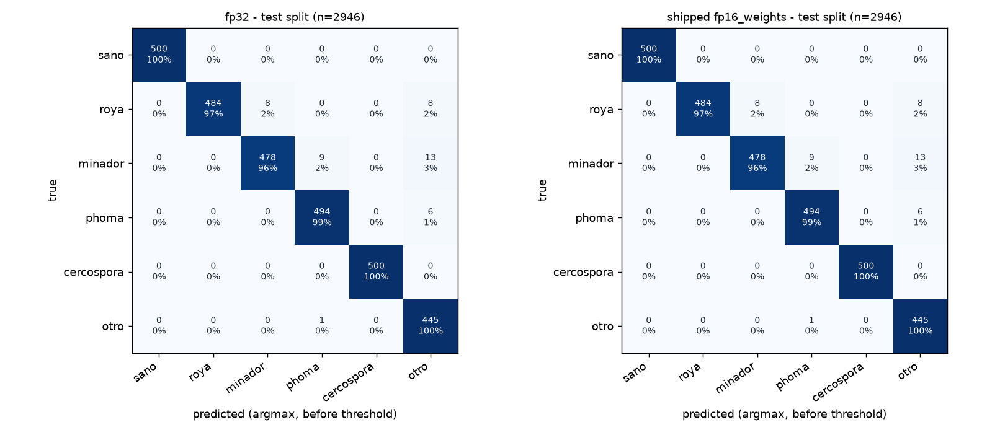

# Cafetal image model - evaluation report

Generated by `model/evaluate.py`. Shipped model: **cafetal-img-v2** (`app/model/cafetal.onnx`, fp16_weights, sha1 1ab8db2a32b8), input 224x224, **threshold 0.9** (0.90 chosen on calibration data only; see reports/field_v2_threshold_sweep.md), blur threshold 4.2. Reference column: **v1** (cafetal-img-v1, threshold 0.7), the app's previous model, evaluated on the same images, decided with its own threshold. All numbers below are **measured** unless marked *computed*.

> **Shipped by explicit team decision, as an exception to the pre-registered ship rule** (2026-10-03, `model/ship_decision.json`). The pre-registered ship rule says DO NOT SHIP: v2 at t = 0.90 passes 4 of its 5 conditions and misses one (reports/field_v2_threshold_test.json): condition (2), JMuBEN test macro-F1 (argmax and app-level) may drop at most 1 point; it drops 1.04 points (0.9670 vs 0.9774 for v1@0.7, section (a)). Why the team shipped it anyway: the Kenyan close-ups it no longer answers go to the fail-safe "No estoy seguro" (DUDA: show the leaf to the officer), not to wrong answers, and it never called a diseased leaf "sano" on either test set; and v2 is the only model that finds rust in field photos (v1 finds none on the held-out field test). Full rule, numbers and decision: `reports/field_eval.md` ("Result", "Threshold trade-off").

> Read this first: the test split comes from the same Kenyan dataset as training (JMuBEN), split by near-duplicate group. It is NOT a field test. The `sano` class has only 2 distinct source photos in test (and 7 in train) - see 'Data' below. Field accuracy on Chiapas photos is unknown until `data/field_test/` is filled. On held-out iNaturalist field photos of leaf rust (a proxy, section (g)) the shipped model answers 64.2% correctly (34 of 53); v1: 0.0% (0 of 53).

## (a) Held-out test split (group split, 70/15/15)

| model | threshold | accuracy (argmax) | macro-F1 (argmax, 6 classes) | app-level macro-F1 (5 coffee classes, DUDA = miss) |
|---|---|---|---|---|
| cafetal-img-v2 fp32 (same weights, float32) | - | 98.6% | 0.9854 | - |
| **shipped cafetal-img-v2** (fp16_weights) | 0.9 | 98.6% | 0.9850 | 0.9670 |
| reference v1 (cafetal-img-v1) | 0.7 | 98.5% | 0.9845 | 0.9774 |

Top-1 agreement fp32 vs shipped on test: 99.97% (1 of 2946 images differ). The argmax columns do not depend on the threshold; the app-level column does (a photo sent to DUDA counts as a miss).

Per class (shipped model, argmax before threshold):

| class | precision | recall | F1 | test images | distinct source groups |
|---|---|---|---|---|---|
| sano | 100.0% | 100.0% | 1.000 | 500 | 2 |
| roya | 95.1% | 100.0% | 0.975 | 500 | 65 |
| minador | 99.0% | 100.0% | 0.995 | 500 | 38 |
| phoma | 99.6% | 98.8% | 0.992 | 500 | 27 |
| cercospora | 99.4% | 100.0% | 0.997 | 500 | 12 |
| otro | 98.6% | 91.9% | 0.951 | 446 | 250 |

### What the app would do (threshold + blur check; `otro` -> DUDA)

| true class | cafetal-img-v2@0.9 correct | cafetal-img-v2@0.9 wrong (accepted) | cafetal-img-v2@0.9 DUDA (fail-safe) | v1@0.7 correct | v1@0.7 wrong (accepted) | v1@0.7 DUDA |
|---|---|---|---|---|---|---|
| sano | 100.0% | 0.0% | 0.0% | 100.0% | 0.0% | 0.0% |
| roya | 89.4% | 0.0% | 10.6% | 88.4% | 0.0% | 11.6% |
| minador | 92.6% | 0.0% | 7.4% | 92.2% | 0.6% | 7.2% |
| phoma | 86.8% | 0.0% | 13.2% | 98.4% | 0.0% | 1.6% |
| cercospora | 100.0% | 0.0% | 0.0% | 100.0% | 0.0% | 0.0% |

- Coffee images answered (coverage): **93.8%** (v1@0.7: 95.9%); accuracy of the answered ones (selective accuracy): **100.0%** (v1@0.7: 99.9%).
- Diseased leaves told 'sano' (the dangerous error): **0.0%** (v1@0.7: 0.0%).
- `otro` test images sent to DUDA: **98.2%** (v1@0.7: 99.8%). By source:

| otro source / view | n | cafetal-img-v2@0.9 rejected (DUDA) | cafetal-img-v2@0.9 argmax = otro | v1@0.7 rejected (DUDA) |
|---|---|---|---|---|
| imagenette/full | 54 | 100.0% | 100.0% | 100.0% |
| plantdoc/crop | 196 | 97.5% | 88.3% | 99.5% |
| plantdoc/full | 196 | 98.5% | 93.4% | 100.0% |

False alarms: the 8 `otro` test image views (of 446; 7 distinct photos, view `crop` = a close-up crop of the same photo) that cafetal-img-v2@0.9 does NOT send to DUDA. Images are not in the repository (PlantDoc / Imagenette terms); paths are under the raw-data folder. `Apple-Scab-image-02.jpg` was the PlantDoc image of the journey test (`tests/e2e/journey.mjs`), which now uses the first PlantDoc test image the shipped model rejects; that check tests the fail-safe path, not the false-alarm rate (that is this table).

| image | view | shipped answer (top-1) | v1@0.7 answer |
|---|---|---|---|
| plantdoc/plant_doc_classification/Apple Scab Leaf/Apple-Scab-image-02.jpg | full | roya (0.981) | DUDA |
| plantdoc/plant_doc_classification/Apple rust leaf/buckinghamshire-speen-garden-cedar-apple-rust-on-apple-underside-of-F5D3RD.jpg | crop | roya (0.944) | DUDA |
| plantdoc/plant_doc_classification/Apple rust leaf/car-apple1.jpg | full | roya (0.992) | DUDA |
| plantdoc/plant_doc_classification/Apple rust leaf/car-apple1.jpg | crop | roya (0.985) | DUDA |
| plantdoc/plant_doc_classification/Apple rust leaf/cedar%20apple%20rust%20upper%20leaf%20surface%20S%20ne%20OH%20RA%209-2-16.jpg | full | roya (0.901) | DUDA |
| plantdoc/plant_doc_classification/Cherry leaf/canada-red-cherry-leaves.jpg | crop | phoma (0.935) | phoma |
| plantdoc/plant_doc_classification/Cherry leaf/img_3088.jpg | crop | roya (0.944) | DUDA |
| plantdoc/plant_doc_classification/Tomato leaf bacterial spot/Bacterial_spots2277.jpg | crop | minador (0.915) | DUDA |

v1@0.7 accepts 1: plantdoc/plant_doc_classification/Cherry leaf/canada-red-cherry-leaves.jpg (crop) -> phoma (0.856).

## (b) Robustness to phone-like degradations (test split, shipped model cafetal-img-v2@0.9)

Proxy for the field gap: the same test images degraded. 'fail-safe' = the app says "No estoy seguro" (DUDA) because of the threshold, the blur check or an `otro` prediction. Here the blur check runs on the cached 224 px view resized to 128 px (also for 'clean'), so its rejections are a little higher than in (a), which scores the original files.

| degradation | accuracy (argmax) | macro-F1 | coffee fail-safe | of which blur check | selective acc. | wrong & accepted | otro rejected |
|---|---|---|---|---|---|---|---|
| clean | 98.6% | 0.985 | 10.4% | 5.3% | 100.0% | 0.0% | 98.2% |
| jpeg_q25 | 97.5% | 0.974 | 7.2% | 0.3% | 100.0% | 0.0% | 99.1% |
| gaussian_blur_r2 | 97.9% | 0.978 | 30.6% | 24.3% | 100.0% | 0.0% | 98.0% |
| gaussian_blur_r4 | 95.5% | 0.953 | 94.4% | 89.9% | 100.0% | 0.0% | 99.3% |
| brightness_x0.6 | 98.6% | 0.985 | 17.9% | 11.5% | 100.0% | 0.0% | 98.4% |
| brightness_x1.4 | 98.6% | 0.986 | 12.8% | 2.7% | 100.0% | 0.0% | 99.1% |
| rotate_90 | 98.7% | 0.987 | 10.5% | 5.3% | 100.0% | 0.0% | 98.0% |
| downscale_64 | 97.5% | 0.974 | 28.7% | 26.1% | 100.0% | 0.0% | 98.2% |

Reference v1@0.7 on the same degraded images:

| degradation | accuracy (argmax) | macro-F1 | coffee fail-safe | of which blur check | selective acc. | wrong & accepted | otro rejected |
|---|---|---|---|---|---|---|---|
| clean | 98.5% | 0.985 | 8.2% | 5.3% | 99.9% | 0.1% | 99.8% |
| jpeg_q25 | 97.5% | 0.975 | 4.4% | 0.3% | 99.7% | 0.3% | 99.8% |
| gaussian_blur_r2 | 97.9% | 0.979 | 26.4% | 24.3% | 99.7% | 0.2% | 99.3% |
| gaussian_blur_r4 | 97.4% | 0.973 | 90.9% | 89.9% | 97.4% | 0.2% | 98.0% |
| brightness_x0.6 | 98.4% | 0.984 | 13.7% | 11.5% | 99.6% | 0.3% | 100.0% |
| brightness_x1.4 | 98.1% | 0.981 | 5.1% | 2.7% | 99.4% | 0.6% | 99.8% |
| rotate_90 | 97.6% | 0.976 | 9.6% | 5.3% | 100.0% | 0.0% | 100.0% |
| downscale_64 | 98.5% | 0.985 | 28.5% | 26.1% | 100.0% | 0.0% | 99.1% |

## (c) Field test - the team's own photos (`data/field_test/`)

**0 images - not yet collected.** Put photos in `data/field_test/<label>/` (labels: sano, roya, minador, phoma, cercospora, acaro_rojo, otro) and rerun `python model/evaluate.py`.

## (e) Real phone photos of coffee plants (iNaturalist, unlabeled)

200 photos. iNatAg-mini/coffea_arabica (iNaturalist, CC BY-NC 4.0): whole plants, flowers, cherries; disease status unknown. Not used for training (neither v1 nor v2). Desired behaviour: mostly DUDA.

Shipped cafetal-img-v2@0.9:

App decision share: DUDA 93.5%, minador 1.0%, roya 5.5%.

Same photos cropped to the centre (closer framing), app decision counts: centre_50pct: DUDA 182, minador 1, roya 17; centre_25pct: DUDA 184, minador 2, roya 14; centre_12pct: DUDA 189, cercospora 1, minador 3, phoma 1, roya 6.

Reference v1@0.7:

App decision share: DUDA 100.0%.

Same photos cropped to the centre (closer framing), app decision counts: centre_50pct: DUDA 200; centre_25pct: DUDA 196, phoma 4; centre_12pct: DUDA 182, cercospora 2, minador 1, phoma 13, roya 2.

Meaning: these are mostly whole plants, flowers and cherries, not leaf close-ups; the desired answer is the fail-safe. Disease answers here are false alarms or real symptoms we cannot check (health is unknown). Labelled Chiapas photos are needed.

## (g) Labelled field photos (iNaturalist, held-out field test)

Held-out field test only (observers not used in training, except the observer of 1 ojo de gallo photo); iNaturalist photos are a proxy for Chiapas photos; details, ship rule and v1/v2 comparison in reports/field_eval.md. Decided like the app (`single`).

Shipped cafetal-img-v2@0.9, app rule `single`:

| group (true label) | n | correct & accepted [95% CI] | wrong but accepted | of which "sano" (dangerous) | DUDA [95% CI] | answers: sano / roya / minador / phoma / cercospora / DUDA |
|---|---|---|---|---|---|---|
| roya | 53 | **64.2%** [51-76] | 0.0% | 0 | 35.8% [24-49] | 0 / 34 / 0 / 0 / 0 / 19 |
| roya screened | 42 | **81.0%** [67-90] | 0.0% | 0 | 19.0% [10-33] | 0 / 34 / 0 / 0 / 0 / 8 |
| roya Mexico+GT box | 31 | **74.2%** [57-86] | 0.0% | 0 | 25.8% [14-43] | 0 / 23 / 0 / 0 / 0 / 8 |
| roya Mexico | 4 | **50.0%** [15-85] | 0.0% | 0 | 50.0% [15-85] | 0 / 2 / 0 / 0 / 0 / 2 |
| minador | 9 | **22.2%** [6-55] | 0.0% | 0 | 77.8% [45-94] | 0 / 0 / 2 / 0 / 0 / 7 |
| minador screened | 9 | **22.2%** [6-55] | 0.0% | 0 | 77.8% [45-94] | 0 / 0 / 2 / 0 / 0 / 7 |
| minador Mexico | 2 | **0.0%** [0-66] | 0.0% | 0 | 100.0% [34-100] | 0 / 0 / 0 / 0 / 0 / 2 |
| cercospora | 10 | **0.0%** [0-28] | 20.0% | 0 | 80.0% [49-94] | 0 / 2 / 0 / 0 / 0 / 8 |
| cercospora screened | 6 | **0.0%** [0-39] | 16.7% | 0 | 83.3% [44-97] | 0 / 1 / 0 / 0 / 0 / 5 |
| ojo_de_gallo (desired: DUDA) | 90 | (no correct class) | 8.9% [5-17] | 0 | **91.1%** [83-95] | 0 / 6 / 1 / 1 / 0 / 82 |
| ojo_de_gallo screened (desired: DUDA) | 26 | (no correct class) | 26.9% [14-46] | 0 | **73.1%** [54-86] | 0 / 6 / 1 / 0 / 0 / 19 |
| coffea sample (health unknown) | 399 | n/a - disease answers: 2.5% [1-5] | n/a | sano answers: 0.0% | 97.5% [95-99] | 0 / 9 / 1 / 0 / 0 / 389 |
| coffea sample Mexico (health unknown) | 37 | n/a - disease answers: 2.7% [0-14] | n/a | sano answers: 0.0% | 97.3% [86-100] | 0 / 1 / 0 / 0 / 0 / 36 |

Reference v1@0.7, app rule `single`:

| group (true label) | n | correct & accepted [95% CI] | wrong but accepted | of which "sano" (dangerous) | DUDA [95% CI] | answers: sano / roya / minador / phoma / cercospora / DUDA |
|---|---|---|---|---|---|---|
| roya | 53 | **0.0%** [0-7] | 1.9% | 0 | 98.1% [90-100] | 0 / 0 / 0 / 1 / 0 / 52 |
| roya screened | 42 | **0.0%** [0-8] | 2.4% | 0 | 97.6% [88-100] | 0 / 0 / 0 / 1 / 0 / 41 |
| roya Mexico+GT box | 31 | **0.0%** [0-11] | 3.2% | 0 | 96.8% [84-99] | 0 / 0 / 0 / 1 / 0 / 30 |
| roya Mexico | 4 | **0.0%** [0-49] | 0.0% | 0 | 100.0% [51-100] | 0 / 0 / 0 / 0 / 0 / 4 |
| minador | 9 | **0.0%** [0-30] | 0.0% | 0 | 100.0% [70-100] | 0 / 0 / 0 / 0 / 0 / 9 |
| minador screened | 9 | **0.0%** [0-30] | 0.0% | 0 | 100.0% [70-100] | 0 / 0 / 0 / 0 / 0 / 9 |
| minador Mexico | 2 | **0.0%** [0-66] | 0.0% | 0 | 100.0% [34-100] | 0 / 0 / 0 / 0 / 0 / 2 |
| cercospora | 10 | **0.0%** [0-28] | 10.0% | 0 | 90.0% [60-98] | 0 / 0 / 0 / 1 / 0 / 9 |
| cercospora screened | 6 | **0.0%** [0-39] | 16.7% | 0 | 83.3% [44-97] | 0 / 0 / 0 / 1 / 0 / 5 |
| ojo_de_gallo (desired: DUDA) | 90 | (no correct class) | 6.7% [3-14] | 0 | **93.3%** [86-97] | 0 / 0 / 4 / 2 / 0 / 84 |
| ojo_de_gallo screened (desired: DUDA) | 26 | (no correct class) | 15.4% [6-34] | 0 | **84.6%** [66-94] | 0 / 0 / 4 / 0 / 0 / 22 |
| coffea sample (health unknown) | 399 | n/a - disease answers: 0.0% [0-1] | n/a | sano answers: 0.0% | 100.0% [99-100] | 0 / 0 / 0 / 0 / 0 / 399 |
| coffea sample Mexico (health unknown) | 37 | n/a - disease answers: 0.0% [0-9] | n/a | sano answers: 0.0% | 100.0% [91-100] | 0 / 0 / 0 / 0 / 0 / 37 |

## (f) Why we split by group: leakage check

Same shipped model on 1800 unused copies (flips/rotations/colour shifts/burst shots) of TRAINING photos, i.e. what a naive random split would have put in the test set. Compare with the group-split test: accuracy **98.9%**, macro-F1 **0.989** vs. **98.6%** / **0.985** on the group-split test.

## (d) Size, speed, download

| model | size | CPU latency, 1 thread (ORT Python) | onnxruntime-web WASM, 1 thread (Node) | 3G 384 kbps (*computed*) | 1 Mbps (*computed*) |
|---|---|---|---|---|---|
| cafetal-img-v2 fp32 | 3.78 MB (3783080 B) | 3.18 ms | 13.8 ms | 78.8 s | 30.3 s |
| shipped cafetal-img-v2 (fp16_weights) | 1.97 MB (1972422 B) | 3.19 ms | 12.5 ms | 41.1 s | 15.8 s |
| reference v1 (cafetal-img-v1) | 1.97 MB (1972251 B) | 3.19 ms | 13.7 ms | 41.1 s | 15.8 s |

Latency: onnxruntime Python 1.19.2, CPUExecutionProvider, 1 thread, batch 1, median of 50, build server x86 CPU (not a phone). Web: onnxruntime-web 1.19.2 WASM backend, 1 thread, Node.js on the build server (not a phone), measured at export time (model/export_onnx.py, calibration record). Download: computed = bytes*8/bitrate, no protocol overhead; throttled-browser measurements are in reports/browser_metrics.md (emulated).

## Calibration (validation split, export of cafetal-img-v2; record `reports/field_v2_calibration.json`)

- Shipped: **fp16_weights** - forced fp16_weights. fp32 ONNX vs Keras max |diff| on 20 images: 9.54e-07.

| candidate | size | val accuracy | val macro-F1 | top-1 agreement with fp32 | runs in onnxruntime-web |
|---|---|---|---|---|---|
| int8_static | 1.38 MB | 15.1% | 0.044 | 14.3% | yes |
| int8_weights | 1.12 MB | 97.1% | 0.971 | 97.6% | yes |
| fp16_weights | 1.97 MB | 97.8% | 0.978 | 100.0% | yes |
| fp32 | 3.78 MB | 97.8% | 0.978 | 100.0% | yes |

- Confidence threshold **shipped: 0.9** (from `app/model/labels.json`: 0.90 chosen on calibration data only; see reports/field_v2_threshold_sweep.md). It was re-chosen after export with a false-alarm constraint on separate calibration data (`model/field_threshold.py`: lowest t with <= 5 % disease answers on 400 new *Coffea* photos and >= 98 % `otro` rejection on validation). The export-time value below (0.7) came from Kenyan validation images only and is kept for the record.
- Export-time confidence threshold **0.7** (data-driven value 0.5: lowest t in [0.50,0.90] where accepted validation predictions reach >= 95% accuracy on clean images AND on clean + 5 phone-like degradations (jpeg q25, blur r2, brightness x0.6/x1.4, downscale 64); blur-rejected images count as not accepted; policy floor 0.7: validation images come from the same Kenyan dataset as training, so confidence on real Chiapas photos will be lower and less reliable; the floor keeps the PLAN.md default 0.70 when the data-driven value is lower).

| threshold | coverage (clean val) | selective accuracy (clean val) | coverage (clean + degraded val) | selective accuracy (clean + degraded val) |
|---|---|---|---|---|
| 0.50 | 97.1% | 99.2% | 92.2% | 97.4% |
| 0.55 | 96.8% | 99.4% | 91.5% | 97.8% |
| 0.60 | 96.6% | 99.4% | 91.0% | 98.2% |
| 0.65 | 96.5% | 99.4% | 90.3% | 98.7% |
| 0.70 | 95.4% | 99.4% | 89.3% | 99.2% |
| 0.75 | 95.1% | 99.4% | 88.4% | 99.4% |
| 0.80 | 94.1% | 99.5% | 87.5% | 99.5% |
| 0.85 | 93.4% | 99.6% | 85.8% | 99.6% |
| 0.90 | 92.1% | 99.7% | 83.9% | 99.7% |

- Blur threshold **4.2** (floor(min over coffee classes of the 5th percentile of real validation images), 1 decimal; algorithm in `model/blur.py`, the app must match).

| class | val n | median Laplacian var | 5th pct | real rejected | blurred r3 median | blurred r3 rejected | blurred r4 rejected |
|---|---|---|---|---|---|---|---|
| sano | 300 | 381.0 | 331.0 | 0.0% | 3.5 | 100.0% | 100.0% |
| roya | 300 | 16.2 | 4.3 | 4.0% | 1.6 | 90.0% | 100.0% |
| minador | 300 | 432.4 | 145.4 | 0.0% | 6.0 | 25.3% | 82.3% |
| phoma | 300 | 642.2 | 290.5 | 0.0% | 7.4 | 0.0% | 65.0% |
| cercospora | 300 | 169.9 | 57.2 | 0.0% | 3.7 | 75.0% | 100.0% |
| otro | 150 | 800.6 | 283.7 | 0.0% | 16.0 | 2.0% | 25.3% |

## Data: near-duplicate grouping and split

Grouping: dHash 72-bit on equalised grayscale 9x9, min over 8 flips/rotations, Hamming <= 8, union-find. Split 70/15/15 by group within each source/label.

| source/label | images | exact-duplicate groups | near-duplicate groups | largest group | groups train/val/test |
|---|---|---|---|---|---|
| imagenette/otro | 700 | 700 | 689 | 5 | 479/105/105 |
| jmuben/cercospora | 7681 | 80 | 78 | 192 | 54/12/12 |
| jmuben/minador | 16978 | 455 | 246 | 352 | 172/36/38 |
| jmuben/phoma | 6571 | 181 | 171 | 160 | 120/24/27 |
| jmuben/roya | 8336 | 520 | 373 | 304 | 245/63/65 |
| jmuben/sano | 18983 | 14 | 11 | 3600 | 7/2/2 |
| plantdoc/otro | 2569 | 2518 | 2440 | 29 | 1700/373/367 |

Images actually used (round-robin over groups, capped): train: sano 1500, roya 1500, minador 1500, phoma 1500, cercospora 1500, otro 2663; val: sano 300, roya 300, minador 300, phoma 300, cercospora 300, otro 267; test: sano 500, roya 500, minador 500, phoma 500, cercospora 500, otro 446.
v2 adds field training views of 147 screened iNaturalist photos to train (see `reports/field_eval.md`, Protocol); validation and test are unchanged.

